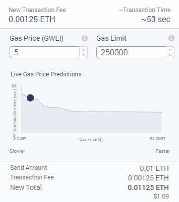

# Gas and Fees

Whenever you place a bid for Land, breed your Apostle, and create or cancel an auction, your request gets sent to miners on the blockchain network who crunch the numbers and confirm the transaction \(thank you, miners!\). For that service the miners receive a network fee paid by the person submitting the transaction request \(please note that entire fee goes to the miners, not the game!\). That fee, sometimes written as “Tx fee,” is determined by two factors: the “Gas Price” of your transaction and the amount of gas used to process it.

Gas Price \(Gwei\) is the amount of ether offered per gas unit to pay miners to process your transaction. Converting Gwei into ether is simple: take the Gwei value and move the decimal point nine spaces to the left. So, 5 Gwei equals 0.000000005 ether.

“Gas Limit” sets the maximum amount of computational power you’ll allow the miner to use before they top out and stop processing your request. Essentially gas limit creates a ceiling on how much ether you want to spend on a given transaction as a way to keep costs reasonable.

## **What gas price should I use?**

Setting a gas price is up to you – some people are more gassy than others – but there are helpful guidelines. The higher the gas price you set, the faster your transaction will get processed. So for more important transactions, think about setting a higher gas price. If, for example, you’re bidding on a Land with decent resource reserve and worry about another player swooping in, set the gas price higher to speed up your request. If you’re just going to breed a couple of your Apostles, it’s fine to set it lower and save some money, but the transaction will take longer.

[Gas Now](https://gasnow.org) is a valuable tool to help manually set your gas price. Use their suggested “Gas Price Standard” to make sure a transaction goes through quickly \(usually, a few minutes\). Select the Gas Price Slow for less important transactions that you’re willing to wait on \(typically around 10 minutes, depending on network traffic\). The Gas Now also shows you approximately how long a transaction will take at a specific Gas Price and lets you select your price based on the time you’re willing to wait.

Keep in mind that your actual transaction fee will almost always be lower than the potential maximum – great! Once a miner executes your transaction, you keep whatever ETH is left over from your gas limit. But if your gas limit is too low and the miner maxes out, your transaction will get cancelled and you’ll still have to pay the max fee – not so great. So make sure to choose a gas limit with enough room to guarantee your transaction goes through. Remember, MetaMask will always suggest the exact amount of gas to use so there’s no need to adjust.

